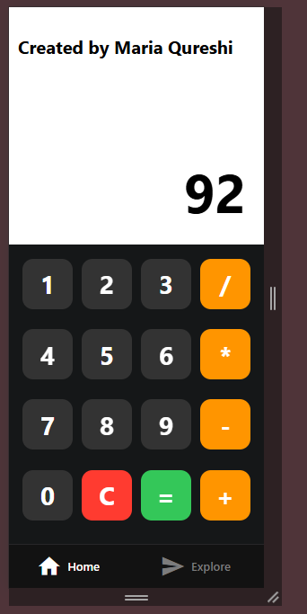

# 🔢 Simple Calculator (React Native Version)

A clean and minimal calculator app built with **React Native**. This project is designed to perform basic arithmetic operations and is optimized for mobile use.

## 🌟 Features

- ➕ Basic operations: Add, Subtract, Multiply, Divide
- 🧹 Clear (`C`) and `=` evaluation buttons
- 🎨 Smooth UI with interactive button feedback
- 💾 Built with React Native and Expo
- ⚡ Fast, lightweight, and mobile-friendly

## 🛠️ Tech Stack

- **React Native** – Mobile UI
- **Expo** – Development and testing
- **TypeScript** – (if used in index files)
- **React Hooks** – State management with `useState`

## 📥 How to Access This Project Locally

This app is not deployed to app stores yet. To run it on your mobile device or emulator:

### 1. Prerequisites

- Install [Node.js](https://nodejs.org)
- Install Expo CLI globally:

npm install -g expo-cli

* Install Expo Go App on your phone:

  * [Android (Play Store)](https://play.google.com/store/apps/details?id=host.exp.exponent)
  * [iOS (App Store)](https://apps.apple.com/app/expo-go/id982107779)

### 2. Clone the Repository

git clone https://github.com/your-username/simple-calculator-react-native.git
cd simple-calculator-react-native

### 3. Install Dependencies

npm install

### 4. Start the App

expo start

* This will open **Expo Dev Tools** in your browser.
* Scan the QR code using the **Expo Go** app on your mobile device (make sure both are on the same WiFi).
* Or press `a` for Android emulator / `i` for iOS simulator.

## 📄 License

This project is licensed under the **MIT License**.
Created by **Maria Qureshi** with ☕ and 💡 for mobile productivity and React Native learning.

